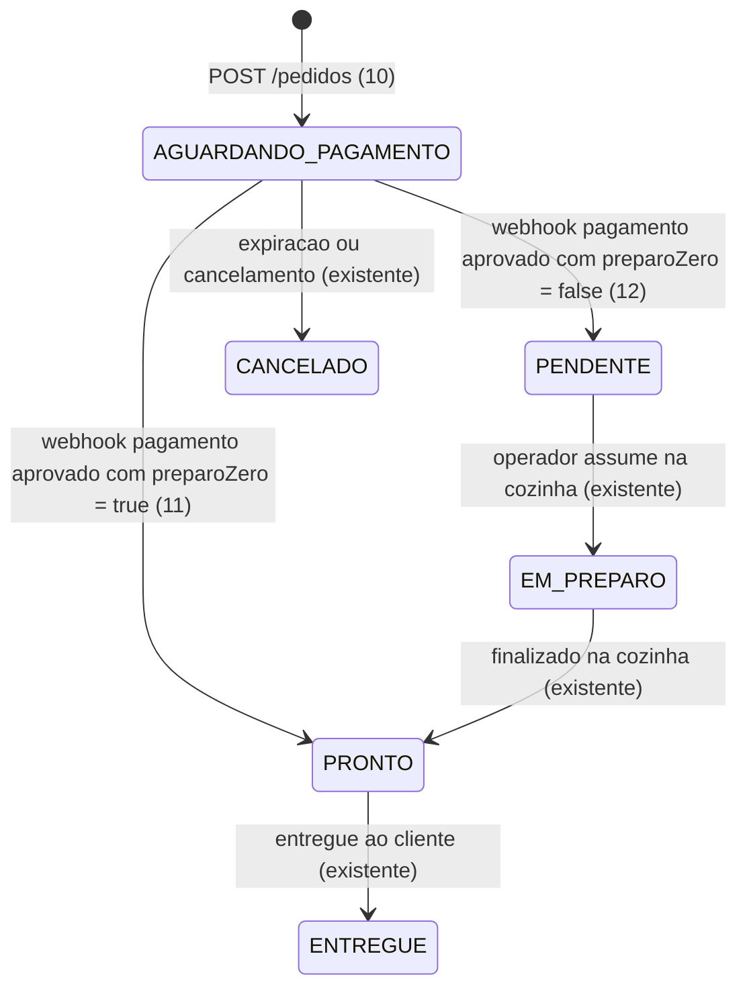
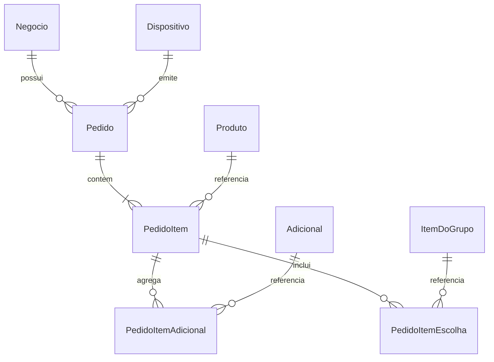

# [BACKEND] Criação de Pedidos e Engine de Snapshot de Preço

> Build this with **tlc-implement**.
> Every criterion below becomes a check with a proof, referenced by its number. Nothing under
> `Unresolved` gets settled while building.

## Intent

Hoje, o backend do TotemOS não possui endpoint de criação ou consulta de pedidos, impedindo que os totens registrem intenções de compra e que a cozinha receba pedidos. Sem um mecanismo centralizado no servidor, qualquer cálculo de valores dependente do cliente expõe o estabelecimento ao risco crítico de fraude de preços ou inconsistência contábil caso os preços do catálogo sofram reajustes após a realização do pedido.

Esta funcionalidade introduz o endpoint `POST /pedidos` com gravação imutável de snapshot dos preços de produtos, adicionais e escolhas de combos no momento exato da compra, cálculo estrito do total no servidor, marcação da regra de preparo zero e vinculação forçada ao `negocioId` do dispositivo autenticado, além das rotas de consulta `GET /pedidos` e `GET /pedidos/:id` com isolamento estrito de tenant.

16 critérios em 4 fatias · 5 decisões irreversíveis · 0 abertas, das quais 0 bloqueiam

## Criteria

### Validação de Payload e Bloqueio de Preço Adulterado

1. Dado um payload de criação de pedido contendo qualquer propriedade de preço (`preco`, `precoBase`, `precoNoMomento`, `valorTotal`), quando submetido para validação no `CriarPedidoSchema`, então a validação falha com erro Zod devido à restrição estrita (`.strict()`).
2. Dado um payload de criação sem a lista de itens ou com array `itens` vazio, quando validado, então o schema rejeita a operação com erro de validação de tamanho mínimo de 1 item.
3. Dado um item de pedido contendo `quantidade` menor ou igual a zero, ou `produtoId` em formato diferente de UUID v4, quando validado, então o schema rejeita o payload.
4. Dado um adicional dentro de um item cujo `adicionalId` não pertença ao respectivo produto ou cuja `quantidade` ultrapasse o limite `maximo` configurado no banco de dados para aquele adicional, quando `POST /pedidos` é executado, então a requisição é rejeitada com status HTTP 400 (`BadRequestException`).

### Engine de Snapshot Imutável e Cálculo de Total no Servidor

5. Dado um dispositivo autenticado vinculado ao `negocioId` com token válido e um pedido contendo 1 produto (preço base cadastrado R$ 25,00) e 2 unidades de um adicional (preço cadastrado R$ 4,00 cada), quando uma requisição `POST /pedidos` é recebida, então o pedido é persistido no banco com `valorTotal = 33.00`, gravando em `PedidoItem.precoNoMomento = 25.00` e em `PedidoItemAdicional.precoNoMomento = 4.00`, independentemente de quaisquer dados externos.
6. Dado um item de pedido com seleção de item de grupo de combo (`itemDoGrupoId`), quando o pedido é persistido, então é gravado em `PedidoItemEscolha` o snapshot `deltaNoMomento` com o valor exato de `ItemDoGrupo.deltaPreco` obtido do banco de dados, integrando a soma do valor total.
7. Se qualquer produto ou adicional informado no payload estiver com `esgotado = true` ou `ativo = false` no catálogo, quando `POST /pedidos` for acionado, então a transação inteira é abortada com rollback e a resposta retorna status HTTP 400 informando a indisponibilidade do item.
8. Dado um `idempotencyKey` UUID fornecido via header HTTP `Idempotency-Key` ou via campo JSON `idempotencyKey` que já foi gravado com sucesso para o mesmo `negocioId`, quando uma nova requisição `POST /pedidos` é enviada, então o backend retorna o pedido previamente criado com status HTTP 200/201 sem duplicar registros no banco.
9. Quando um pedido é criado via `POST /pedidos`, então o backend atribui `dataSequencial` no formato `YYYY-MM-DD` e a `senha` sequencial diária do estabelecimento (iniciando em 1 para o primeiro pedido do dia ou incrementando `max(senha) + 1`), garantindo atomicidade na transação Prisma contra duplicidades na restrição única `[negocioId, dataSequencial, senha]`.

### Regra de Preparo Zero e Estado Inicial

10. Sempre que um pedido for criado com sucesso via `POST /pedidos`, o seu status inicial gravado no banco de dados deve ser obrigatoriamente `AGUARDANDO_PAGAMENTO`.
11. Dado um pedido em que todos os produtos associados aos itens possuam `tempoEstimadoPreparo = 0` no catálogo no momento da criação, quando criado via `POST /pedidos`, então o pedido é gravado com `preparoZero = true`, marcando-o internamente para avanço automático na confirmação do pagamento.
12. Dado um pedido que contenha ao menos um produto com `tempoEstimadoPreparo > 0`, quando criado via `POST /pedidos`, então o pedido é gravado com `preparoZero = false`.

### Consulta de Pedidos com Isolamento de Tenant

13. Dado um cliente autenticado no estabelecimento `negocio-A`, quando requisita `GET /pedidos`, então a resposta retorna status HTTP 200 com array de pedidos pertencentes exclusivamente ao `negocioId === 'negocio-A'`, nunca exibindo pedidos de `negocio-B`.
14. Dado um cliente autenticado no estabelecimento `negocio-A` tentando acessar `GET /pedidos/:id` onde o identificador pertence a um pedido do `negocio-B`, então o servidor responde com status HTTP 404 (`NotFoundException: Pedido não encontrado`), preservando o sigilo entre estabelecimentos.
15. Dado um cliente autenticado no estabelecimento `negocio-A` requisitando `GET /pedidos/:id` com identificador de um pedido legítimo do mesmo estabelecimento, então a resposta retorna status HTTP 200 contendo o pedido completo com seus itens, adicionais, escolhas e os respectivos snapshots de preços.
16. Se uma requisição para `POST /pedidos`, `GET /pedidos` ou `GET /pedidos/:id` não contiver cabeçalho `Authorization: Bearer <token>` válido ou o dispositivo/usuário estiver inativo, então a requisição é rejeitada com status HTTP 401 (`UnauthorizedException`).

## States

## Out of scope

- Processamento de webhook de pagamento do Mercado Pago - coberto em tarefa dedicada de integração de pagamentos.
- Alteração manual de status de preparo de pedidos via KDS (`PATCH /pedidos/:id/status`) - pertence ao módulo da cozinha/KDS.
- Reconciliação offline em lote (`POST /pedidos/reconciliar`) - tratado na tarefa específica de resiliência offline.
- Pagamentos em dinheiro físico - fora de escopo de acordo com a especificação técnica do TotemOS v1.

## Observable

| Surface | Decision | Landing |
| --- | --- | --- |
| API `POST /pedidos` | formato e resposta de sucesso | 5 |
| API `POST /pedidos` | validação e códigos de erro (400, 401) | 1, 2, 3, 4, 7, 16 |
| API `POST /pedidos` | autorização por token de dispositivo | 16 |
| API `POST /pedidos` | idempotência contra duplicações (header ou body) | 8 |
| API `GET /pedidos` | listagem e filtro de tenant | 13 |
| API `GET /pedidos` | autorização por token JWT/dispositivo | 16 |
| API `GET /pedidos/:id` | retorno detalhado com snapshot completo | 15 |
| API `GET /pedidos/:id` | erro 404 para recursos de outro tenant | 14 |
| API `GET /pedidos/:id` | autorização por token JWT/dispositivo | 16 |

## Swept

- validation: 1, 2, 3, 4
- failure modes: 7, 16
- idempotency and retry: 8
- authorization: 14, 16
- concurrency and ordering: 9
- data lifecycle: n/a - pedidos são registros fiscais/contábeis imutáveis e não sofrem exclusão
- external-dependency failure: n/a - operações dependem unicamente da base PostgreSQL interna
- state transitions: 10, 11, 12
- observability: 5

## Impact

| Front | What changes |
|---|---|
| domain | new term: `Snapshot de Preço` - valor monetário unitário imutável congelado na criação do pedido, gravado em `PedidoItem.precoNoMomento`, `PedidoItemAdicional.precoNoMomento` e `PedidoItemEscolha.deltaNoMomento` |
| domain | new term: `Preparo Zero` - pedido no qual todos os itens têm `tempoEstimadoPreparo = 0`, avançando direto para `PRONTO` quando o pagamento for aprovado, registrado em `Pedido.preparoZero` |
| stored data | adição do campo `preparoZero Boolean @default(false)` ao modelo `Pedido` no `apps/backend/prisma/schema.prisma` |

## Decided

| Decision | Shape | Alternative rejected |
|---|---|---|
| Cálculo estrito de preços e snapshots no servidor | Backend consulta `Produto`, `Adicional` e `ItemDoGrupo` diretamente no banco dentro de transação Prisma para definir `precoNoMomento` e `valorTotal` | Aceitar valores calculados enviados pelo cliente Totem (rejeitado por vulnerabilidade severa de fraude de preços) |
| Isolamento de Tenant via token | `negocioId` extraído obrigatoriamente do payload do token do dispositivo ou do usuário autenticado | Receber `negocioId` no corpo do payload JSON (rejeitado por quebrar o princípio de isolamento seguro de tenant) |
| Bloqueio estrito de campos de preço no DTO | `CriarPedidoSchema.strict()` rejeitando qualquer chave desconhecida como `preco`, `precoBase`, `valorTotal` | Permitir propriedades desconhecidas e descartá-las silenciosamente (rejeitado para garantir validação preventiva de payloads adulterados) |
| Persistência explícita da flag de Preparo Zero | Coluna `preparoZero Boolean @default(false)` no modelo `Pedido` | Recalcular o tempo estimado em tempo de execução ao receber o webhook (rejeitado porque produtos podem ser alterados ou removidos após a criação da venda, quebrando o princípio de snapshot imutável) |
| Atribuição segura de senha na criação online | Em `POST /pedidos`, se a senha não vier informada, calcular a próxima `senha` sequencial diária por estabelecimento na transação Prisma | Permitir senha nula (rejeitado pois `senha` é `Int` obrigatório e compõe a chave única `@@unique([negocioId, dataSequencial, senha])` no banco) |
| Flexibilidade na chave de idempotência | Suporte tanto ao header `Idempotency-Key` quanto ao campo `idempotencyKey` no body JSON, com precedência para o header | Aceitar exclusivamente pelo body ou exclusivamente pelo header (rejeitado para manter interoperabilidade com clientes HTTP padrão e bibliotecas mobile) |

## Relations

## Surface

| Route | In | Out | Status | Criteria |
|---|---|---|---|---|
| `POST /pedidos` | `CriarPedidoDto`, header `Authorization`, header `Idempotency-Key` opcional | `Pedido` (com itens, adicionais e snapshot) | 201, 400, 401 | 1, 2, 3, 4, 5, 6, 7, 8, 9, 10, 11, 12, 16 |
| `GET /pedidos` | query: `status?`, `dataSequencial?`, header `Authorization` | `Pedido[]` | 200, 401 | 13, 16 |
| `GET /pedidos/:id` | param: `id`, header `Authorization` | `Pedido` detalhado | 200, 401, 404 | 14, 15, 16 |

## Sources

- `docs/backend-SPEC.md` - Especificação de endpoints e modelo de dados Prisma para `Pedido`, `PedidoItem`, `PedidoItemAdicional` e `PedidoItemEscolha`.
- `AGENTS.md` - Regras Não-Negociáveis 1 (Isolamento de Tenant), 2 (Snapshot de Preço), 3 (Confirmação de Pagamento), 4 (Autoridade de Senha) e 6 (Preparo Zero).
- `docs/arquitetura-tecnica-v1.md` - Topologia geral, fluxo de venda online e fluxo de resiliência offline.

## Unresolved

| # | Kind | Question | Until answered |
|---|---|---|---|
| None | | | |
