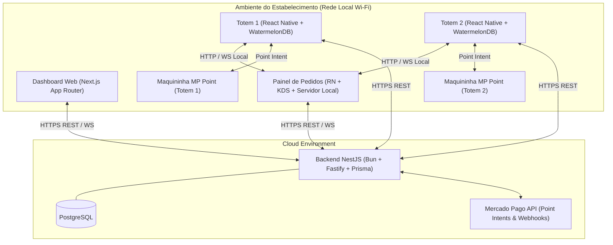
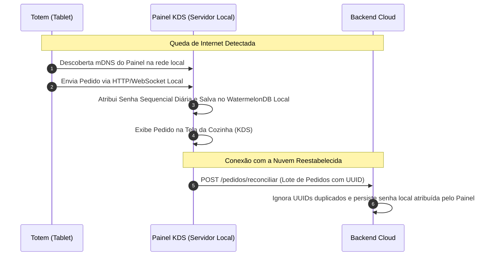

# Arquitetura Técnica — TotemOS (v1)

Visão geral da topologia de rede, fluxos de dados e estratégias de resiliência offline do ecossistema TotemOS.

---

## 1. Topologia Geral do Sistema

---

## 2. Fluxo de Venda Online (Com Conexão)

1. **Seleção e Intent**: O cliente escolhe os itens no **Totem 1** e solicita o pagamento.
2. **Intent Point**: O **Totem 1** envia `POST /pagamentos/intent` para o **Backend Cloud**.
3. **Acionamento da Maquininha**: O **Backend Cloud** se comunica com a API do Mercado Pago Point, que aciona a **Maquininha MP Point 1**.
4. **Pagamento pelo Cliente**: O cliente insere/aproxima o cartão ou paga via Pix no visor da maquininha.
5. **Webhook Assíncrono**: O Mercado Pago dispara um webhook para `POST /pagamentos/webhook/mercadopago`.
6. **Notificação em Tempo Real**: O **Backend Cloud** atualiza o pedido para `PENDENTE` e notifica o **Painel de Pedidos (KDS)** via WebSocket.
7. **Emissão de Senha**: O **Painel** recebe o pedido, atribui a senha sequencial do dia e o exibe na fila da cozinha.

---

## 3. Fluxo de Resiliência Offline (Sem Conexão à Nuvem)

---

## 4. Escopo da v1 vs Futuro

### Incluído na v1
- Isolamento estrito por `negocioId`.
- Atribuição de senha pelo Painel de Pedidos.
- Mapeamento 1:1 de Totem para Maquininha MP Point.
- Snapshot obrigatório de preços (`precoNoMomento`).
- Reconciliação em lote offline com UUID de idempotência.

### Fora do Escopo da v1
- Planos e cobrança de SaaS ao lojista.
- Emissão fiscal (NFC-e / SAT).
- Impressoras térmicas dedicadas (impressão limitada à maquininha MP Point se disponível).
